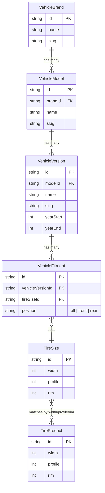

# Fitment Engine (Vehicle Compatibility)

## Visão Geral
O **Vehicle Fitment Engine** permite aos clientes encontrarem pneus compatíveis utilizando os dados do próprio veículo (Marca, Modelo, Ano e Versão). 

Ele é desenhado para não criar relações diretas entre `Veículo <-> Pneu (SKU)`, mas sim utilizando uma entidade pivot chamada `TireSize`.

## Diagrama Entidade-Relacionamento

## Fluxo do Cliente

1. **TireFinder**: O usuário acessa a busca na Home e altera para "Por Veículo".
2. **Cascata**: Seleciona Marca -> Habilita Modelos -> Seleciona Modelo -> Habilita Anos -> Seleciona Ano -> Habilita Versões.
3. **Busca**: Submete o formulário, sendo roteado para `/pneus/veiculo/[brand]/[model]/[year]/[version]`.
4. **Service**: O `VehicleCompatibilityService` identifica a Versão -> Busca os Fitments -> Carrega os `TireSizes` -> Busca os Produtos cujo `width/profile/rim` batam com as medidas.
5. **PDP Checker**: Na PDP, o usuário pode preencher novamente os selects. O sistema cruza os `TireSizes` da versão selecionada com as medidas daquele Produto específico e retorna *Compatible* ou *Incompatible*.

## Importante (Source: Development)
Os dados populados na `AdminLocalDB` v2 oriundos de `mock-vehicles.ts` são meramente ilustrativos. Num cenário de produção real, estes dados viriam de uma API de Tabela Fipe estendida ou banco de dados especializado em montadoras (homologado).
